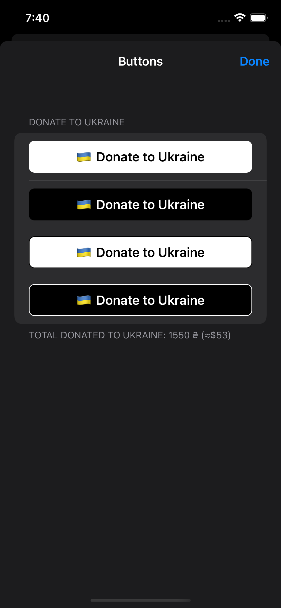
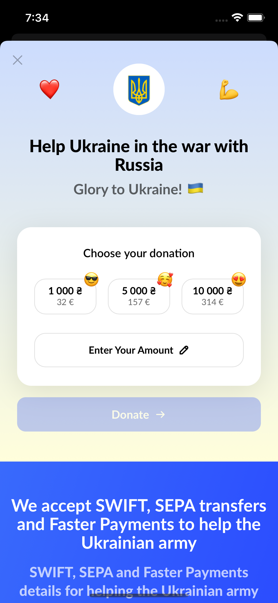
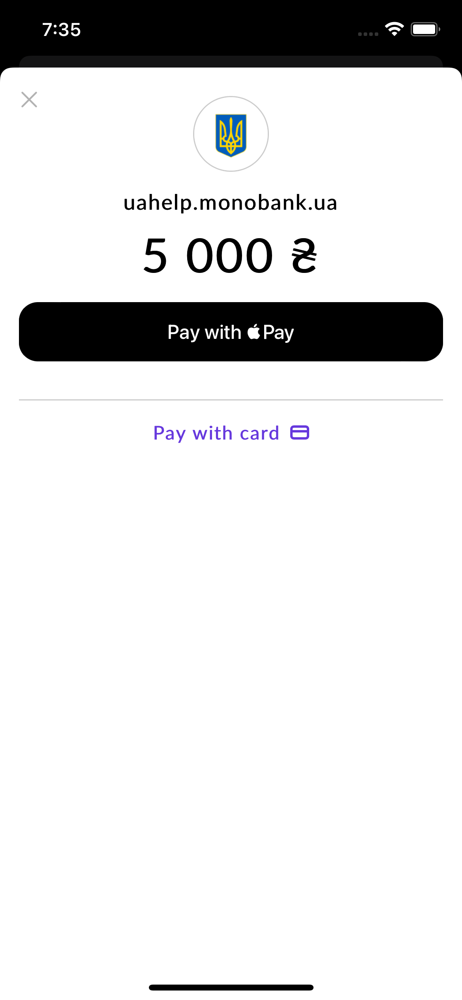

# DonateToUkraine 


> **DonateToUkraine** uses monobank's official donation service. You can always donate on your own: [https://uahelp.monobank.ua](https://uahelp.monobank.ua)

**DonateToUkraine** gives you a simple way to provide "donate to Ukraine" functionality in your app via an [official donation service](https://uahelp.monobank.ua) (endorsed [here](https://twitter.com/ng_ukraine/status/1498058822740553733)). The service will be opened inside the app, keeping a native feel. Apple Pay is supported.

Additionally, **DonateToUkraine** also provides you with `DonateToUkraineButton` out of the box in different styles, and a UserDefaults-backed way to track completed donations.

| Buttons | Step 1 | Step 2 |
| --- | --- | --- |
|  |  |  |

Maintainer: [@dreymonde](https://github.com/dreymonde)

## Usage

```swift
DonateToUkraine.withDonation(contextViewController: self) { donation in
    // success!
}
```

### Using `DonateToUkraineViewController`

```swift
let donateVC = DonateToUkraineViewController { donation in
    // donation.amount
    // donation.amount.uah
    // donation.amount.approxUSD
    // donation.donatedAt
    // donation.receiptId
}
self.present(donateVC, animated: true)
```

### "Donate to Ukraine" buttons

```swift
let button = DonateToUkraineButton(
    style: .black,
    variant: .donate,
    contextViewController: self
)
button.didOpen = { /* ... */ }
button.completion = { donation in /* ... */ }

// or:

let button = DonateToUkraineButton(
    style: .black,
    variant: .donate
)
button.contextViewController = self
```

Styles:

```swift
.black
.white
.automatic // .black in light mode, .white in dark mode

.blackOutline
.whiteOutline
.automaticOutline
```

Variants (text):

```swift
.donate // "Donate to Ukraine", default
DonateToUkraineButton.Variant(rawValue:) // custom text
```

### Donation tracking & history

You can use this to "unlock" some functionality after a donation is made.

```swift
if DonateToUkraine.hasDonated {
    /* success! */
}
let allDonations = DonateToUkraine.donationReceipts
let totalDonatedUAH = DonateToUkraine.totalDonated.uah
let totalDonatedUSD = DonateToUkraine.totalDonated.approxUSD
```

Note: donation history uses `UserDefaults` and is cleared on app uninstall.

## Installation

### Swift Package Manager
1. Click File &rarr; Swift Packages &rarr; Add Package Dependency.
2. Enter `http://github.com/dreymonde/DonateToUkraine.git`.
