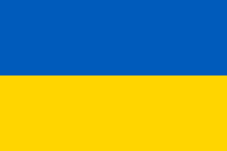

# DonateToUkraine 


> **DonateToUkraine** uses monobank's official donation service. You can always donate on your own: [https://uahelp.monobank.ua](https://uahelp.monobank.ua)

**DonateToUkraine** gives you a simple way to provide "donate to Ukraine" functionality in your app via an [official donation service](https://uahelp.monobank.ua) (endorsed [here](https://twitter.com/ng_ukraine/status/1498058822740553733)). The service will be opened inside the app, keeping a native feel. Apple Pay is supported.

Additionally, **DonateToUkraine** also provides you with `DonateToUkraineButton` out of the box in different styles, and a UserDefaults-backed way to track completed donations.

| Buttons | Step 1 | Step 2 |
| --- | --- | --- |
|  |  |  |

Maintainer: [@dreymonde](https://github.com/dreymonde)

## Usage

```swift
DonateToUkraine.withDonation(contextViewController: self) { donation in
    // success!
}
```

### Using `DonateToUkraineViewController`

```swift
let donateVC = DonateToUkraineViewController { donation in
    // donation.amount
    // donation.amount.uah
    // donation.amount.approxUSD
    // donation.donatedAt
    // donation.receiptId
}
self.present(donateVC, animated: true)
```

### "Donate to Ukraine" buttons

```swift
let button = DonateToUkraineButton(
    style: .black,
    variant: .donate,
    contextViewController: self
)
button.didOpen = { /* ... */ }
button.completion = { donation in /* ... */ }

// or:

let button = DonateToUkraineButton(
    style: .black,
    variant: .donate
)
button.contextViewController = self
```

Styles:

```swift
.black
.white
.automatic // .black in light mode, .white in dark mode

.blackOutline
.whiteOutline
.automaticOutline
```

Variants (text):

```swift
.donate // "Donate to Ukraine", default
DonateToUkraineButton.Variant(rawValue:) // custom text
```

### Donation tracking & history

You can use this to "unlock" some functionality after a donation is made.

```swift
if DonateToUkraine.hasDonated {
    /* success! */
}
let allDonations = DonateToUkraine.donationReceipts
let totalDonatedUAH = DonateToUkraine.totalDonated.uah
let totalDonatedUSD = DonateToUkraine.totalDonated.approxUSD
```

Note: donation history uses `UserDefaults` and is cleared on app uninstall.

## Apps that use "DonateToUkraine"

- [F1 Flying Lap](https://f1flyinglap.com)
- ...
- [Add yours!](https://github.com/dreymonde/DonateToUkraine/edit/main/README.md)

## Installation

### Swift Package Manager
1. Click File → Swift Packages → Add Package Dependency.
2. Enter `http://github.com/dreymonde/DonateToUkraine.git`.

## What happens to the money?

**DonateToUkraine** uses an [official donation service](https://uahelp.monobank.ua) created by [Monobank](https://www.monobank.ua/?lang=en), one of the largest and most trusted banks in Ukraine. The service was endorsed by the Ukrainian government [here](https://twitter.com/ng_ukraine/status/1498058822740553733).

As you can read on the [https://uahelp.monobank.ua](https://uahelp.monobank.ua) webpage, every donation is transferred directly to a special account opened by the National Bank of Ukraine to raise funds for Ukraine’s Armed Forces. Official announcement of the account: [here](https://bank.gov.ua/en/news/all/natsionalniy-bank-vidkriv-spetsrahunok-dlya-zboru-koshtiv-na-potrebi-armiyi).

NBU regularly reports on the money it raises, and how it's being distributed. An example of such report [here](https://bank.gov.ua/en/news/all/nbu-pererahuvav-na-potrebi-viyskovih-ponad-1496-mlrd-grn-na-spetsrahunku-zalishilosya-58-mln-grn).

Keep in mind that weapons are negotiated between governments on a higher level and are funded / purchased through different channels. The vast majority of donations made to the official NBU account goes towards support payments for soldiers and their families, as well as local purchases of medical supplies, protective gear etc.

If you have any questions regarding the donations, don't hesitate to reach out to me at [oleg@dreyman.dev](mailto:oleg@dreyman.dev).

